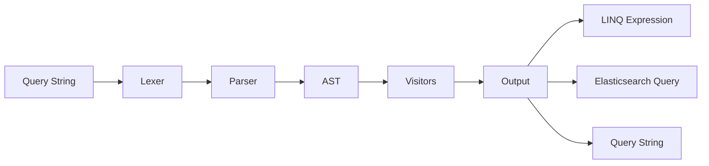

# What is Foundatio.LuceneQuery?

Foundatio.LuceneQuery is a library for adding dynamic Lucene-style query capabilities to your .NET applications. It enables your users to write powerful search queries using familiar Lucene syntax, with built-in support for Entity Framework Core and Elasticsearch.

This project is a modern replacement for [Foundatio.Parsers](https://github.com/FoundatioFx/Foundatio.Parsers).

## Why Lucene Query Syntax?

Lucene query syntax is a widely-adopted standard for search queries. Users familiar with tools like Elasticsearch, Kibana, or Apache Solr will feel right at home. The syntax is powerful yet intuitive:

```
title:hello AND (status:active OR priority:[1 TO 5])
```

## How It Works



The library works in three main phases:

1. **Parsing** - The query string is tokenized and parsed into an Abstract Syntax Tree (AST)
2. **Transformation** - Visitors can modify, validate, or analyze the AST
3. **Output** - The AST is converted to the desired output format (LINQ, Elasticsearch Query DSL, or back to a query string)

## Key Features

### 🔍 Full Lucene Query Syntax

Support for the complete Lucene query syntax:

- **Terms**: `hello`, `hello*`, `hel?o`
- **Phrases**: `"hello world"`, `"hello world"~2`
- **Fields**: `title:test`, `user.name:john`
- **Ranges**: `price:[100 TO 500]`, `date:{* TO 2024-01-01}`
- **Boolean**: `AND`, `OR`, `NOT`, `+`, `-`
- **Groups**: `(a OR b) AND c`
- **Special**: `_exists_:field`, `_missing_:field`, `*:*`
- **Regex**: `/pattern/`

### 🗃️ Entity Framework Integration

Convert Lucene queries directly to LINQ expressions for EF Core:

```csharp
var parser = new EntityFrameworkQueryParser();
Expression<Func<Employee, bool>> filter = parser.BuildFilter<Employee>(
    "name:john AND salary:[50000 TO *]"
);
var results = await context.Employees.Where(filter).ToListAsync();
```

### 🔎 Elasticsearch Integration

Generate Elasticsearch Query DSL using the official Elastic.Clients.Elasticsearch 9.x client:

```csharp
var parser = new ElasticsearchQueryParser(config =>
{
    config.UseScoring = true;
    config.DefaultFields = ["title", "content"];
});
var query = parser.BuildQuery("author:john AND status:active");
```

### 🔄 Round-Trip Capable

Parse queries to an AST and convert back to query strings:

```csharp
var result = LuceneQuery.Parse("title:test AND (status:active OR status:pending)");
var queryString = QueryStringBuilder.ToQueryString(result.Document);
// Returns: "title:test AND (status:active OR status:pending)"
```

### 🛡️ Query Validation

Restrict what users can query with validation options:

```csharp
var options = new QueryValidationOptions
{
    AllowLeadingWildcards = false
};
options.AllowedFields.Add("title");
options.AllowedFields.Add("status");

var validationResult = await QueryValidator.ValidateAsync(document, options);
```

### 🏷️ Field Aliasing

Map user-friendly field names to your actual data model:

```csharp
var fieldMap = new FieldMap
{
    { "user", "account.username" },
    { "created", "metadata.timestamp" }
};
await FieldResolverQueryVisitor.RunAsync(result.Document, fieldMap);
```

### 📅 Date Math Support

Elasticsearch-style date math expressions:

```csharp
// Supports expressions like:
// now-1d          (one day ago)
// now+1h          (one hour from now)
// 2024-01-01||+1M/d  (January 1st 2024 plus one month, rounded to day)
```

## Use Cases

- **Search APIs** - Let users filter data with powerful query syntax
- **Admin Dashboards** - Enable complex filtering without custom UI for each field
- **Reporting** - Allow dynamic report criteria using familiar search syntax
- **Data Export** - Let users specify exactly what data they need
- **Audit/Log Search** - Search through logs with date ranges, terms, and boolean logic

## Next Steps

Ready to get started? Here's what to explore next:

- [Getting Started](./getting-started) - Install and set up your first query
- [Query Syntax](./query-syntax) - Learn all the supported syntax
- [Entity Framework](./entity-framework) - Integrate with EF Core
- [Elasticsearch](./elasticsearch) - Integrate with Elasticsearch
